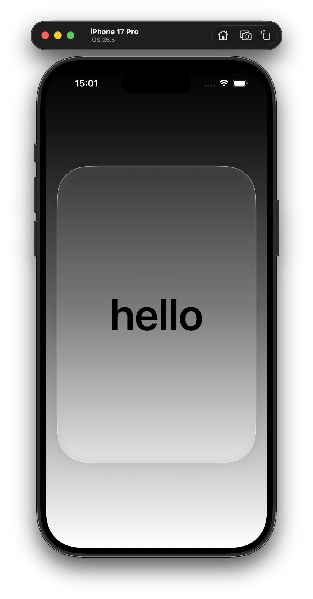
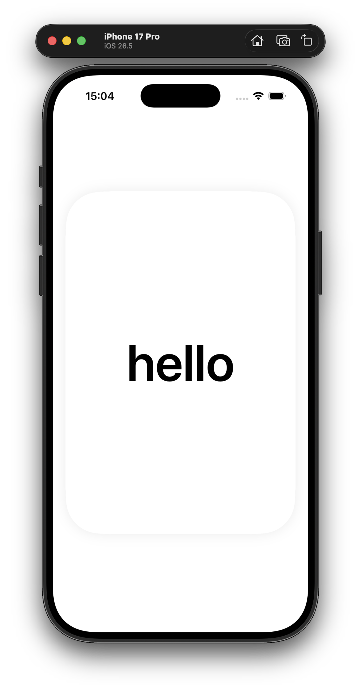
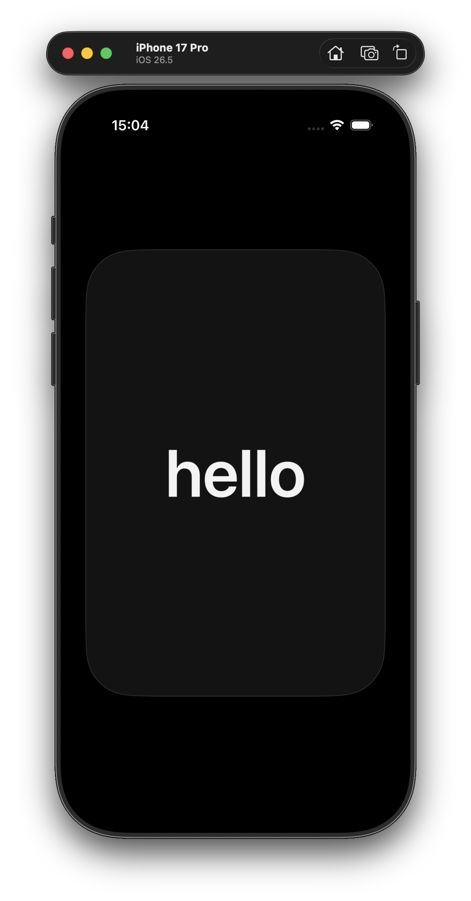

# HelloDanci

A SwiftUI vocabulary learning app inspired by Apple's Liquid Glass design language.

## Features

- Liquid Glass card UI
- SwiftUI animation
- Gesture interaction
- Modern Apple-style interface

## Tech Stack

- Swift
- SwiftUI
- iOS
- Xcode
  
## Preview

  
  
  

## Author

Zane Zhang
